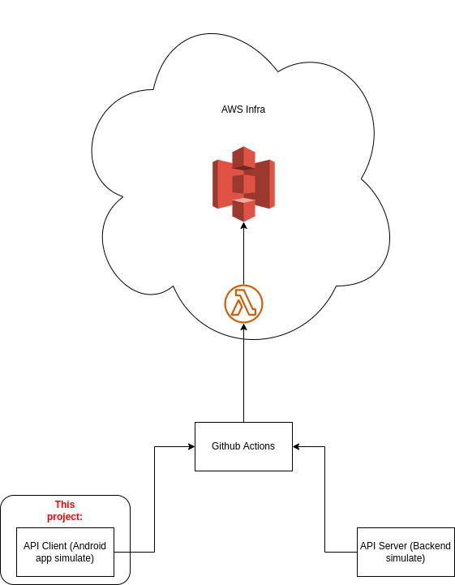
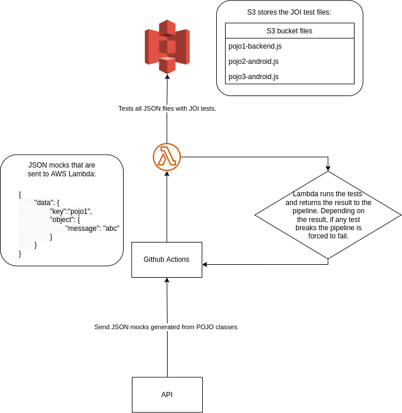

# Contract test lab (or schema)

This project is part of a lab on contract test practices. The main idea is to be able to validate external communications contracts through the disparity of POJO classes between services.

## Architecture

The architecture follows the diagram below.

## How to create a test schema

1. Whenever a new POJO is created, you must add the annotation `@SchemaTestsScan(key = "key")`. By doing this we run the following command to generate mock objects of all our POJO's:

   `mvn compile exec:java -Dexec.mainClass=dev.diegofernando.apiserver.utils.GenerateFakeObjects`

   The objects will be saved in a single JSON file. We can find it in "schema_tests/schemas.json"

2. Enter the "schema_tests/tests" directory and run "node index.js".

   It will run the tests using the Joi library from the file "schema_tests/schemas.json". Our test will fail as it was not created. To create it, just add a new Joi test in the "schema_tests/tests/schemas" directory. Important: the test file must follow the same name as the key in the "@SchemaTestsScan" annotation.

## How the pipeline works

Here is the pipeline execution flow diagram:

1. After committing to a branch and making a **Pull Request** for the main branch, the pipeline will be triggered.
2. After doing the validation using "node index.js", the pipeline sends the mocks to Lambda.
3. Leader logic:
   Before going to the next step, it is important to understand the logic of the leader. This logic consists of defining that when a platform adds a new test set (POJO and JOI test) and completes the cycle until reaching the main branch, that platform becomes the owner of the test. This means that when this platform changes the contract for your POJO, the pipeline will not fail because it will understand that it can be a natural evolution rather than a breach of contract. Despite this, the idea is to have a warning and work with some type of notification (slack, telegram, etc.), because when the other platform runs its pipeline, it will fail, until the contract is the same as the one implemented on the leading platform.
4. The Lambda function response has the following statuses:

   **SUCCESS_SCHEMA_TESTS_AND_SCHEMA_UPDATE_BY_OWNER**: Some POJO's that already existed were successfully tested and some other POJO's where the platform is a leader were evolved. The pipeline will pass with warning and when it goes to the main branch, pipelines from other platforms may break if they also implement the evolved POJO.

   **SCHEMA_UPDATE_BY_OWNER**: Some other POJO's where the platform is a leader have been evolved. The pipeline will
   pass with warning and when it goes to the main branch, pipelines from other platforms may break if they also implement the evolved POJO.

   **FAILED_SCHEMA_TEST**: Some POJO's that are implemented on other platforms are not the same with what was
   implemented. The pipeline will fail in this case, until the POJO's are equal.

5. In case of success, the pipeline will pass allowing the merge to the main branch to be done. When merging to main, another pipeline is started. This is responsible for sending to Lambda the POJO's and their respective new JOI tests and also the ones that were evolved.

## Technologies used

- Java
    - [Reflections](https://github.com/ronmamo/reflections) - Capture only classes annotated with "@SchemaTestsScan".
    - [JEMOS Podam](https://mtedone.github.io/podam/) - Create Java fake objects.
- NodeJs
    - [joi](https://joi.dev/api) - Contract tests
- Infra
    - [AWS Lambda](https://aws.amazon.com/pt/lambda/) - Orchestration of contract tests and communication with S3.
    - [S3](https://aws.amazon.com/pt/s3/) - Storage of JOI test files.
    - [API Gateway](https://aws.amazon.com/pt/api-gateway/) - Creates an external endpoint for Lambda access.

## Related repositories

- [contract-tests-example](https://github.com/diegofsousa/contract-tests-example) - Simulates a backend.
  environment that uses the proposed engine.
- [contract-tests-lambda](https://github.com/diegofsousa/contract-tests-lambda) - Orchestrates tests in the cloud environment.
